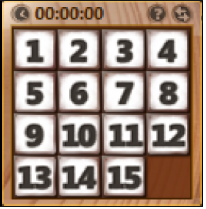
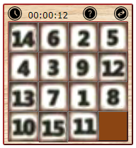

# Windows Picture Puzzle Remastered

A remastered version for Windows' desktop gadget, Picture Puzzle, originally available in Windows Vista and 7.

Original Game | Remastered Version (Not Completed)
--- | ---
 | 

## Description

Windows Picture Puzzle Remastered is a minigame which you can play via Chrome's browser extension.

The inspiration of this project is that I came across such puzzle in a gift shop in real life and realized that Windows once has
a minigame gadget, Picture Puzzle, available in Windows Vista and 7. However, due to security issues, Picture Puzzle and other gadgets such as the Weather
gadget, has been removed ever since. The goal of this project is to recreate the game in modern graphics while keeping all the original features intact, including
its mechanisms and animations.

Challenges faced in this project includes obtaining a copy of the game (which is called off, and instead, videos of its gameplay are watched for references), understanding the hidden mechanisms of the software (e.g. 0 second game winning "feature"), and recreating an updated version of the UI.

This project is built with Javascript, HTML and CSS only.

## Getting Started

### Dependencies

* An up-to-date Google Chrome Browser

### Installing

1. Download the ZIP folder containing all the necessary files on [GitHub](https://github.com/Tyler-CY/Chrome-Volume-Booster), either by clicking the green "Code" button on the top right or through "Packages" tab on the right.
2. Unzip the ZIP folder in your preferred location. By default, the ZIP folder is in your Downloads directory.
3. Go to [Chrome Extensions](chrome://extensions/) (If the hyperlink doesn't work, the link is chrome://extensions/).
4. Turn on "Developer Mode" on the top right corner and select "Load unpacked" on the top left corner.
5. Select the directory Windows-Picture-Puzzle-Remastered (or Windows-Picture-Puzzle-Remastered-VERSION_NUMBER).
6. Enable "Windows Picture Puzzle Remastered".

### Executing program

1. Begin using this extension by pinning the extension on the top right corner.
2. Click on the icon to play immediately.

## Authors

[Tyler-CY](https://github.com/Tyler-CY)

## Version History

* TBD

## License

* TBD

[comment]: <> (This project is licensed under the Tyler-CY License - see the LICENSE.md file for details)

## Acknowledgments

* [Official Chrome Extension Developer Documentation](https://developer.chrome.com/docs/extensions/mv3/)
